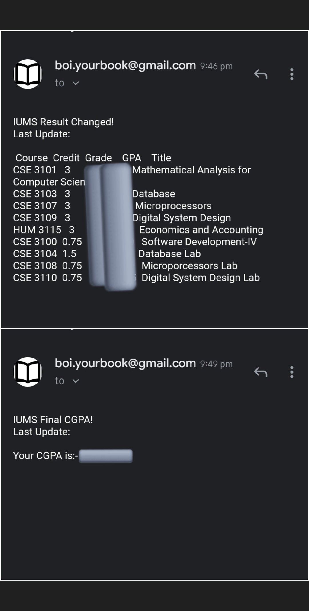

# IUMS-Result-Notifier

So I am a kind of lazy coder! And my university gives our course results in a Integrated University Management System hosted on a website, but without giving any notification
or e-mail. And literally I had to do login multiple times(call it hundreds!) a day to know whether any course result has published or not(XD)!
After learning some basic web scraping, done a small colab script which enters to the site, scraps the selected portion where result always publishes, checks whether any changes in it or not, 
then sends it to my email if any changes were made.

## Libraries
    Selenium, Smtplib

## How it works?
    Save the result in a txt file. 
    Updates after each 10 minutes and checks the previous txt file with the new one. 
    If find changes, e-mails it to the receiver. 
   
    
   Details: https://youtu.be/2LFvI5KbltQ

## How to run
    1. Allow your gmail account to access lower security app (for sending email through that account)
    2. Then follow: https://joequery.me/guides/python-smtp-authenticationerror/
    3. Update gmail_user = 'your less secure email' and gmail_password = 'your less secure email password'
    4. Run the cells!
    5. If you find any issue with the folder or txt file, run '#Delete the folder' cell.

## Caution!
    1. If AUST IUMS site made any changes, this code will not work. User has to modify by inspecting the site.
    2. Works on colab, so you've to make sure colab terminal is always running.

